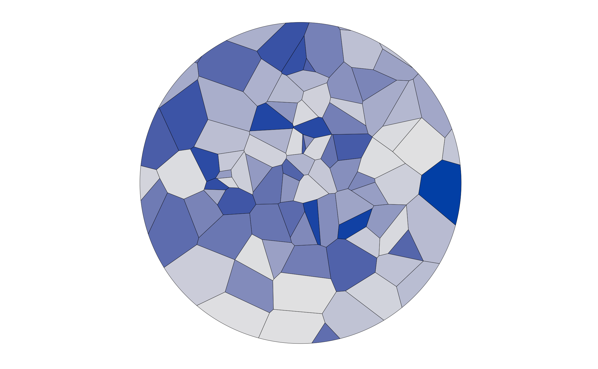

```{r out.width="100%",echo  =F}
#
```

Samme koncept som min "Blue Vorentex #47". Blot lavet med `ggvoronoi` i stedet for polære koordinater.

```{r eval = FALSE}
library(tidyverse)
library(ggvoronoi)
library(deldir)
```

Producer tilfældige punkter, på en reproducerbar måde.

```{r eval = FALSE}
set.seed(47)
tiler <- 100
x <- rnorm(tiler)
y <- rnorm(tiler)
```

Beregn "tiles" - jeg er stadig i tvivl om der findes et dansk ord for det - og saml dem i en dataframe:


```{r eval = FALSE}
points <- data.frame(x=x, y=y) %>% 
  rowid_to_column("id") %>% 
  mutate(id = as.integer(id))
```

Dernæst plotter vi dem, og tilføjer en cirkel for at lave et udsnit. Det er "outline" i `geom_voronoi`:

```{r eval = FALSE}
s <- seq(0, 2 * pi, length.out = 3000)
radius <- 2
c_x <- 0
c_y <- 0
circle <- data.frame(x = radius * (c_x + cos(s)),
                     y = radius * (c_y + sin(s)),
                     group = rep(1, 3000))

points %>% 
  ggplot(aes(x = x, y = y, fill = factor(id))) +
  geom_voronoi(outline = circle,  color = 1, size= 0.1) +
  theme_minimal() +
  theme(legend.position = "none" ,
        axis.text = element_blank(),
        axis.title = element_blank(),
        axis.line = element_blank(),
        axis.ticks = element_blank(),
        panel.grid = element_blank()) +
        scale_fill_manual(values = hcl.colors(100, "Blues 2")) +
        theme(legend.position = "none") +
  coord_fixed()

ggsave("Blue_Vorontex-47.2.png")
```

